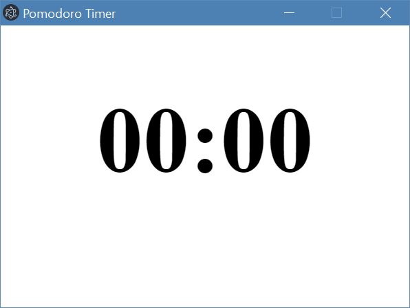
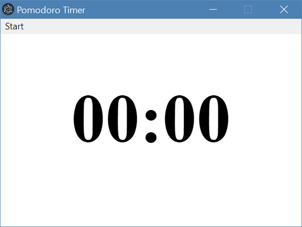

# Lesson 2 - Pomodoro Timer App - Creating your first window with a native menu bar
Developing desktop applications used to be a difficult and tedious task. Today, Electron makes desktop application development surprisingly easy. In this lesson, we are going to show you how quickly we can create a pomodoro timer app with Electorn.

## Part 1 - Setup
**Project Structure:**
* `main.js` - The main electron application script
* `index.html` - The web view for the main window
* `renderer.js` - External Javascript for the main window
* `style.css` - External stylesheet for the main window
* `package.json` and `package-lock.json` - Holds the details of your project and its dependencies

By now you should already have this repository cloned onto your computer. Navigate to `lesson-2/starter-code` from ther terminal and run `npm install` to install all the necessary modules for this project.

## Part 2 - Creating your first window
If you open `main.js`, you will see that we have already done some coding for you to get you started. On `line 2`, you should see
```js
const { app, BrowserWindow, Menu } = require('electron')
```
which imports the necessary modules from electron. To create a window, we need to listen for electron’s `ready` event, which gets fired when electron is ready to process your application script (`line 31`): 
```js
app.on('ready', createWindow)
```
connects the ready event with a function called createWindow, and you will be writing the code to create your first window inside this function.

Let's start creating your first window, enter the following lines on at `TODO: PART 2`
```
let mainWindow = new BrowserWindow({width: 400, height: 300, resizable: false})
```
creates a `400x300` window that is not resizable. After we have our window, which is equivalent to a chrome tab, we can display a webpage called `index.html` inside it with the following code:
```js
mainWindow.loadFile('index.html')
```
If you run your app now with the command npm start, you should have the following window


## Part 3 - Menu Configuration
Electron can automatically create a top menu bar from json. Inside createWindow function at `TODO: PART 3 - A`, we use
```js
const menu = Menu.buildFromTemplate(template)
Menu.setApplicationMenu(menu)
```
to tell electron to generate the application menu from the json object ‘template’, and set the application menu to the menu that we just generated.

You should also remove the following line, it was used to remove the default menu. Since we are creating our own menu, it is not needed anymore.
```js
Menu.setApplicationMenu(null)
```
Now let’s define the menu object ‘template’ at `TODO: PART 3 - B`:
```js
let template = [{
  label: 'Start'
}]
```
If you run the app now, you will see that there is a button called `start` on the top left, but clicking it doesn’t do anything yet, because we haven’t connected the button with the renderer script.


## Part 4 - Connect menu with timer
This is probably the most important part of this lesson, and you will learn a very important topic of electron.

There are two js files inside your project folder so far, and they run in separate processes. Main.js runs in the application process, and renderer.js runs in the window process. It is crucial to have each window to be sandboxed in its own process, so a crash of a single process does not make the entire application unresponsive. It is also good for security reasons.

However, communication between processes is difficult, but luckily, electron has an easy-to-use ipc(interprocess communication) API. Using this API, you can send any messages with a channel name between any processes.

Inside your menu template object (at `TODO: PART 2 - B`), add a click handler for the start button:
```js
click: function (item, focusedWindow) {
  if (focusedWindow) {
    focusedWindow.webContents.send('start timer', 5);
  }
}
```
sends `5` in channel `start timer` to the renderer process. Your menu template object should look like this:
```js
let template = [{
  label: 'Start',
  click: function (item, focusedWindow) {
    if (focusedWindow) {
      focusedWindow.webContents.send('start timer', 5);
    }
  }
}]
```

Finally, in `renderer.js` at `TODO: PART 4`, use
```js
const ipc = require('electron').ipcRenderer

ipc.on('start timer', function (event, arg) {
   startTimer(arg);
});
```
To receive ‘5’ and pass it in function startTimer to start the timer.

`startTimer(timeInSeconds)` is a function already written for you in `renderer.js`. If you call the function with a number `n`, it will start an `n`-second timer 

Now you should have a basic pomodoro app working!

## Part 5 - Bonus Challenges
1. Add more options to the menu to start different timers.
2. Too many menu items can clutter the screen, explore how sub-menu works

