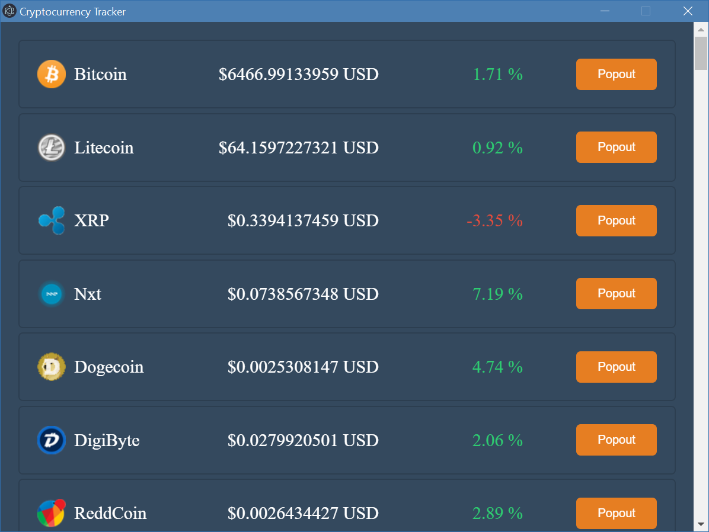

# Lesson 5 - Youtube Wrapper App - Interprocess Communication and Windows Management
In previous lessons, we briefly went over some features of ipc, but have never really explained how ipc works. Now, we are going to uncover the power of ipc in depth through making a multi-windowed application.

## Part 1 - Interprocess Communication (IPC)
In every electron app, there is a main process which runs in the background. It is not required for an electron app to have a window, but each additional window you create is going to have its own render process.

It should be apparent that we would like communications to occur betweeen
* Main process and a render process
* Two render processes

Unfortunately, communication between two render processes is not supported in Electron. If you want to communicate between two windows A and B, you have to use IPC to send a message from window A to the main process, and write code for the main process to forward that message to window B.

The APIs of IPC is straight forward. There are 3 scenarios to communicate via IPC.

### 1. ipcRenderer
This is the only way a window can send messages to the main process.

import ipcRenderer from electron:
```js
// In renderer process (web page).
const {ipcRenderer} = require('electron')
```
When this window receives a message in channel `asynchronous-reply` from the main process, we output the message to the console
```js
ipcRenderer.on('asynchronous-reply', (event, arg) => {
  console.log(arg) // prints "pong"
})
```

Send a message to the main process in channel `asynchronous-message`
```js
ipcRenderer.send('asynchronous-message', 'ping')
```
[Read more](https://electronjs.org/docs/api/ipc-renderer)

### 2. ipcMain
Use ipcMain to listen for a message form a render process and optionally send a reply

import ipcMain from electron:
```js
// In main process.
const { ipcMain } = require('electron')
```
When the main process receives a message from a render process in channel `asynchronous-message`, we print the message to the console and send a response 'pong' through the channel `asynchronous-reply`
```js
ipcMain.on('asynchronous-message', (event, arg) => {
  console.log(arg) // prints "ping"
  event.sender.send('asynchronous-reply', 'pong')
})
```
[Read more](https://electronjs.org/docs/api/ipc-main)

### 3. webContent.send
If you have a reference of a window in your main process, you can access the webContent of that window to initiate ipc to that window's render process

let `win` be a reference to a newly create window
```js
// In main process
let win = new BrowserWindow({width: 800, height: 600})
win.loadFile('src/index.html')
```
`did-finish-load` is an even that is called when the window has finished loading the page. In this case, we want to send `whoooooooh!` to that window's render process through channel `ping`
```js
win.webContents.on('did-finish-load', () => {
    win.webContents.send('ping', 'whoooooooh!')
})
```
[Read more](https://electronjs.org/docs/api/web-contents#webcontentssendchannel-arg1-arg2-)

Note: The [remote API](https://github.com/electron/electron/blob/master/docs/api/remote.md) actually allows you to access the main electron API (i.e. creating windows, notifications, menus) inside your render processes. However, they are `synchronous` and blocking, because they use a synchronous ipc under the hood. Using `remote` is not recommended, because your application UI will freeze everytime you use it.
## Part 2 - Multi-Window App Best Practice
To make the development of multi-windowed applications easier, you should manage all windows of your application inside your main process by having a map to store the reference of each window. All creations and deletions of windows should be handled by the main process, and all messages between windows should be and can only be sent through the main process. Essentially, the main process acts as a package distribution center. Imagine if you want to send a package to a friend, you would give the package to Fedex, and Fedex will deliver that package to your friend's house.

In your main process, you should define an object to keep track of all windows in your application
```js
let windows = {}
```

Define a `createWindow` function to handle all windows creation and keep their references in `windows` object we just created
```js
function createWindow(params){
  const win = new BrowserWindow(params)
  let winId = win.id;
  /*
      Each window has a unique id. 
      We can use this unique id as the key to store the window reference in `windows` object
  */
  windows[winId] = win

  /*
      This is fired when the window `win` is closed. 
      We want to remove the reference to this window from `windows` object
  */
  win.on('closed', () => {
      delete windows[winId]
  })

  // return the newly created window so we can modify it right after calling this function
  return win;
}
```

## Part 3 - Cryptocurrency Tracking App - Setup
We are going to create a cryptocurrency tracking app that allows users to create always-on-top floating windows

You are probably already familiar with the setup at this point. Navigate to `lesson-5/starter-code` and run 
```
npm install
```
in your terminal to get your project ready.

**Project Structure:**

You should only be modifying code inside the `src` folder
* `main.js` - The main electron application script
* `index.html` - The web view for the main window
* `dashboard.js` - External Javascript for the main window
* `style.css` - External stylesheet for the main window
* `popout.html` - The web view for the popout window
* `popout.js` - External Javascript for the popout window
* `style_popout.css` - External stylesheet for the popout window

## Part 4 - Create the main window
Open `src/main.js` in VS Code, and replace `TODO: PART 4 - A` with the following code
```js
let window = createWindow({ title: 'Crypto Dashboard', width: 800, height: 600, resizable: false })
window.loadFile('./src/index.html')
window.webContents.on('did-finish-load', () => {
  window.webContents.send('crypto-data', cryptoData)
})
```
which creates a `800x600` unresizable window with the title `Crypto Dashboard`. It's UI loaded from `./src/index.html`. In addition, we are sending the window the cryptocurrency data through the channel `crypto-data` as soon as the window is ready. If you skim through the `watchCrypto` function in the same js file, you can see that it is sending `cryptoData` to all windows every 5 seconds.

We are using the `createWindow` function we defined in `Part 2`. Since this function is already included in `main.js`, you can use it directly. `did-finish-load` is a special reserved event by electron that is triggered when the respective window is loaded and ready.

Now we need to read and process the message in the main window's render process. Open `dashboard.js` and add the following code after `TODO: PART 4 - B`:
```js
const ipc = require('electron').ipcRenderer

ipc.on('crypto-data', function (event, arg) {
  refreshTable(arg)
})
```

Here we are simply receiving the data we sent from `main.js`. The actual data processing is already done for you. You can take a look at `refreshTable` if you are interested.

Run your application with `npm start` inside your working directory (The same folder where your `package.json` is, not `src` folder!). You should see something like this:


I am sorry if you are bothered by the misalignment of the prices. UI is not the priority of this lesson. However, it can be a good exercise for you to fix it.

## Part 5 - Create the popup windows
In this final part of the tutorial, we are sending a message from the a render process and processing it in `main.js`

Open `dashboard.js` and replace `TODO: PART 5 - A` with the following code
```js
ipc.send('crypto-popout', btnId)
```
This piece of code is inside a function that is called when a specific popout button is clicked. By sending an ipc message through channel `crypto-popout`, we are letting `main.js` know when and which button has been clicked by the user.

To receive and process the message, Open `main.js` and find `TODO: PART 5 - B`
```js
ipcMain.on('crypto-popout', (event, arg) => {
  let targetCoin
  for(const coinId in cryptoData.data){
    if(cryptoData.data[coinId].website_slug === arg){
      targetCoin = cryptoData.data[coinId]
      break
    }
  }
  let popout = createWindow({ title: `${targetCoin.name} Popout`, width: 500, height: 100, frame: false, transparent: true, resizable: false, alwaysOnTop: true })
  popout.loadFile('./src/popout.html')
  popout.webContents.on('did-finish-load', () => {
    popout.send('crypto-info', arg)
    popout.send('crypto-data', cryptoData)
  })
})
```
The for loop in the beginning is simply matching the `btnId` we sent to a specific crypto coin data. After we found the respective coin associated with the button, we create a popout window, and send that window which coin data it should display along with the entire `cryptoData` we have.

The properties we passed in `createWindow` are pretty self-explanatory. We are creating a frameless transparent window that always stay on top of all other windows.

We are almost done. All that's left is to read the `cryptoData` from the popup window and display it.

Open to `popout.js` and use the following code at `TODO: PART 5 - C`
```js
const ipc = require('electron').ipcRenderer

let targetCoinTag

ipc.on('crypto-info', function (event, arg) {
  targetCoinTag = arg
})

ipc.on('crypto-data', function (event, arg) {
  let coin
  for(const coinId in arg.data){
    if(arg.data[coinId].website_slug === targetCoinTag){
      coin = arg.data[coinId]
      break
    }
  }
  const img = './coins/64x64/' + coin.website_slug + '.png'
  const price = coin.quotes.USD.price.toFixed(2)
  document.getElementById('main').innerHTML = `
    
    <span class="crypto-price">$${price}</span>
  `
})
```
Channel `crypto-info` tells us which coin this popout window should display, and we render the actual data when we receive `cryptoData` from the channel `crypto-data`

Lastly, you notice that there is no close button on the popout windows because they are frameless. However, we can just close the entire application when the user closes the main window.

Go to `main.js` and `TODO: PART 5 - D`:
```js
window.on('closed', () => {
  app.quit()
})
```
`closed` is another special reserved event. In this case, we tell electron to close the app when the main window is closed.

If you run the application and click the popout buttons, you get little floating windows that you can freely drag around on your screen:


By now you should hopefully be pro at electron ipc. This is a very important topic, because it also extends to web development. You can [explore](https://www.w3schools.com/html/html5_webworkers.asp) if you are interested